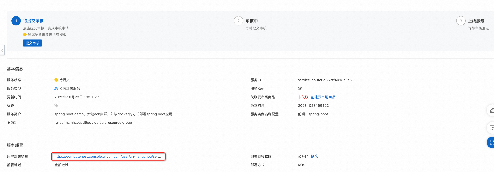
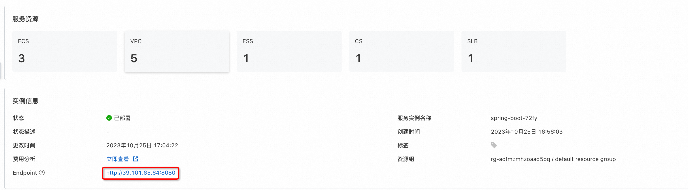

# 服务模板说明文档

## 服务说明

本文介绍SpringBoot服务ack+docker版快速上手流程，本示例对应的Git仓库地址：[springboot-ack-docker-demo](https://github.com/aliyun-computenest/springboot-ack-docker-demo)。

本示例会自动的构建计算巢服务，具体的服务构建流程为:

1. 构建并上传docker镜像，创建计算巢容器镜像部署物
2. 创建计算巢服务并关联容器镜像部署物

创建过程大约持续1分钟，当服务变成待提交后构建成功。

## 服务架构

本部署架构为ack集群部署，将docker镜像以service的方式部署到ack集群中，通过service绑定的loadBalancer的公网ip进行访问，在本例中，service提供的对外端口为8080，和容器对外提供的端口相同。

## 服务构建计费说明

测试本服务构建无需任何费用，创建服务实例涉及的费用参考服务实例计费说明。

## 服务实例部署流程

### 部署步骤

0. 部署链接

1. 单击部署链接，进入服务实例部署界面，根据界面提示，填写参数完成部署。

2. 参数填写完成后可以看到对应询价明细，确认参数后点击**下一步：确认订单**。

3.  确认订单完成后同意服务协议并点击**立即创建**，随后进入部署阶段。

4. 等待部署完成后就可以开始使用服务，进入服务实例详情点击visitUrl。

5. 部署结果

## 服务详细说明

本文通过将[spring-boot](https://atomgit.com/flow-example/spring-boot)构建后，将deploy.sh和application.jar打包成package.tgz,对其中的application.jar打包成docker镜像,
通过计算巢部署物上传为容器镜像部署物，在模版中创建ACK集群，将容器镜像部署物部署到ACK集群上。
templates/template.yaml主要由三部分组成：Parameters、Resources和Outputs

1.Parameters，定义需要用户填写的参数，包括付费类型，ACK实例规格和实例密码可用区等参数。
2.Resources定义需要开的资源，包括新开的vpc、loadBalancer、ack集群。ALIYUN::CS::ClusterApplication资源类型会将镜像按yaml文件部署到ACK集群中，其中{{ computenest::acr::dockerconfigjson }}是下载docker所需secret的占位符，计算巢服务会在部署时替换为对应的下载秘钥。{{ computenest::acrimage::demo }} 是容器镜像仓库的占位符，计算巢服务会替换成对应的镜像仓库地址。
3.Outputs定义需要最终在计算巢概览页中对用户展示的输出，展示SpringBoot的访问地址，负载均衡地址加服务端口。

## 其他

[实例代码源地址](https://atomgit.com/flow-example/spring-boot)

[软件包package.tgz构建流程参考](https://help.aliyun.com/document_detail/153848.html)